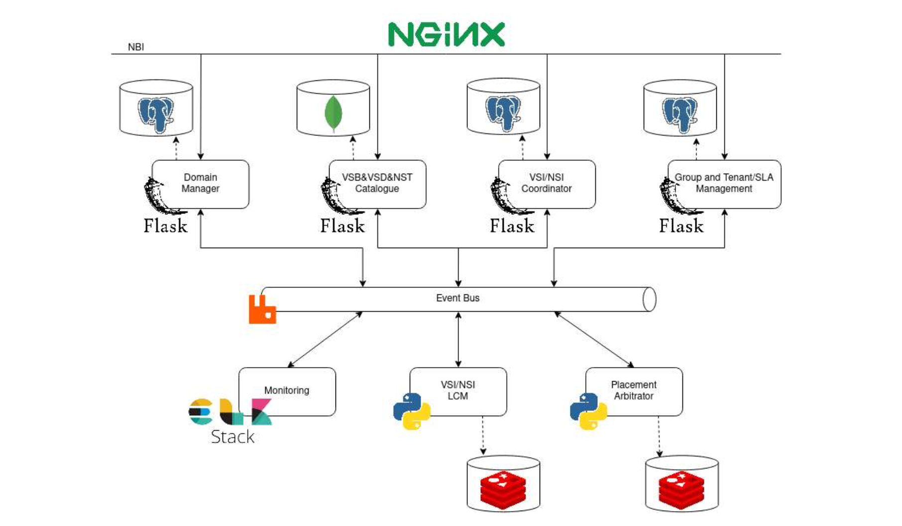
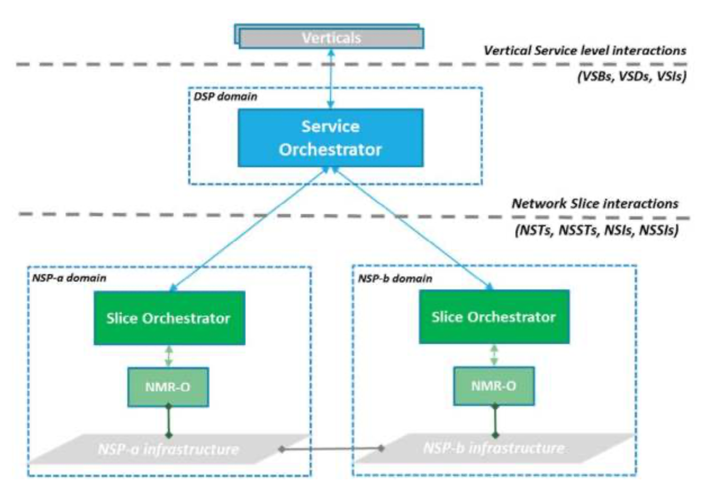
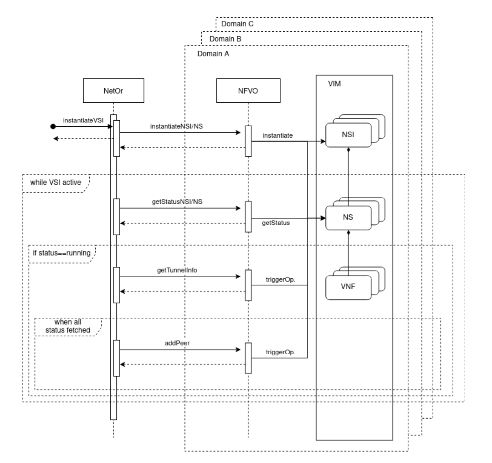

# NetOr

## Architecture



### Basic workflow

Micro-architeture and event-driven. Every module is independent and all of them communicate through the Event Bus (RabbitMQ)

### Components

#### Catalogue

- Persistance service, allows creation, onboarding, management and deletion of new descriptors and templates.
- Exposes a **REST API** (Flask). 
- Documented with Flasgger library.
- Has a Document DB (Mongo DB).


#### Group/Tenant Manager

- Handles both the Groups and Tenants of the system, allows creation, management and deletion.
- Also serves as an IdP (Identity Provider) by providing a centralized authentication service (using Oauth2).
- Exposes a **REST API** (Flask).
- Documented with Flasgger library.
- Has a Relational DB (PostgreSQL).


#### Domain Manager

- Allows creation, management, and deletion of domains.
- Handles communications with lower-level orchestration entities of each domain.
- Exposes a **REST API** (Flask).
- Has a Relational DB (PostgreSQL).


#### VSI/NSI Coordinator 

- Handles operations related to high-level VSI. Triggers the VSI orchestration processes for the rest of the system.
- Exposes a **REST API** (Flask).
- Has a Relational DB (PostgreSQL).


#### VSI/NSI LCM Manager

- Manages the VSI themselves and possible sub-components (NSIs and NSs). Each VSI originates a new management agent that handles all the operations for the vertical service.
- Has a Redis instance as a memory cache.


#### Placement Arbitrator 

- Processes information related to Vertical Services (blueprints, descriptors and templates. Defines the deployment location of each sub-component and possible restrictions.
- Has a Redis instance.


### Multidomain automatic mechanism



- Centralized service orchestration agent (CSMF / Service Orchestrators) that comunicares with lower-level orchestrators (NSMFs / Slice Orchestrator).
- E2E Network Slice Subnets connections possible, using a **VPN** tunnel between them. This creates an inter domain secure communication channel. Implemented with Wireguard. 
- NetOr serves as the centralized service orchestrating agent, gathering and redistributing theinter-domain information.

Workflow between NetOr and Domains: 




### Web Portal

#### Admin

Manages:

- Groups;
- Tenants;
- Dmains;
- Auxiliary service structures.


#### Tenant

- Uses those pre-defined structures to instantiate services for his use cases.


# API Documentation


## VS LCM API


### Generic example of a Vertical Service json used in the API:

```json
{
  "additionalConf": [
    {
      "componentName": "3_1-test",
      "conf": "yaml"
    }
  ],
  "description": "desc",
  "domainId": 1,
  "domainPlacements": [
    {
      "componentName": "test_VSI-3_1",
      "domainId": "ITAV"
    }
  ],
  "errorMessage": "error",
  "locationConstraints": {
    "alt": 1.1,
    "lat": 1.1,
    "long": 1.1,
    "range": 1.1
  },
  "mappedInstanceId": 1,
  "name": "vetService",
  "nestedVsi": [
    1
  ],
  "networkSliceId": 1,
  "nssis": {
    "domainId": 1,
    "nsDeploymentFlavorId": 1,
    "nsInstantiationLevelId": 1,
    "nssiId": 1,
    "nsstId": 1,
    "status": "SUCCESS"
  },
  "ranEndPointId": 1,
  "status": "online",
  "userData": {
    "dynamicKey": "dynamicValue"
  },
  "vsdId": 1,
  "vsiId": 1,
  "vssis": {
    "blueprintId": 1,
    "descriptorId": 1,
    "domainId": 1,
    "instanceId": 1,
    "verticalServiceStatus": "SUCCESS"
  }
}
```


#### Get all vertical services in the system

* **URL: **`/vs`

* **Method:** `GET`

**Success Response:**

​	**Code:** `200 OK`

```json
[
  {
    VS_1
  },
  {
    VS_2
  },
  ...
]
```


#### Create new Vertical Service

* **URL: ** `/vs`

* **Method:** `POST`

**Request body:**

```json
{
  new_VS
}
```

**Success Response:**

​	**Code:** `200 OK`

```json
{
  "message": "Success"
}
```


#### Remove a Vertical Service

* **URL:** `/vs/{vsi_id}`

* **Method:** `DELETE`

**Success Response:**

​	**Code:** `200 OK`

```json
{
  "message": "Success"
}
```


#### Get a specific Vertical Service

* **URL:** `/vs/{vsi_id}`

* **Method:** `GET`

**Success Response:**

​	**Code:** `200 OK` 

```json
{
  VS_1
}
```


#### Modifie/terminate/sendAction of a Vertical Service

* **URL:** `/vs/{vsi_id}`

* **Method:** `PUT`

**Success Response:**

​	**Code:** `200 OK` 

```json
{
  "message": "Success"
}
```


## Domain Management API


### Generic example of a Domain json used in the API:

```json
{
  "admin": "joao",
  "auth": true,
  "description": "test",
  "domainAgreement": [
    {
      "domainAgreeWithId": 1,
      "domainLayersListAgreeWith": [
        1
      ]
    }
  ],
  "domainId": "ITAV",
  "interfaceType": "HTTP",
  "name": "test",
  "ownedLayers": [
    {
      "domainLayerId": 1,
      "domainLayerType": "OsmDomainLayer",
      "password": "admin",
      "project": "admin",
      "type": "NETWORK_SLICE_PROVIDER",
      "username": "admin",
      "vimAccount": "microstack"
    }
  ],
  "owner": "IT",
  "port": 80,
  "status": "active",
  "url": "10.0.12.118"
}
```


#### Get all the Domains in the system

* **URL:** `/domain`

* **Method:** `GET`

**Success Response:**

​	**Code:** `200 OK` 

```json
[
 {
   domain_1
 },
 {
   domain_2
 },
 ...
]
```
 

#### Create new Domain

* **URL:** `/domain`

* **Method:** `POST`

**Request body: **

 ```json
 {
 	new_domain
 }
 ```

**Success Response:**

​	**Code:** `200 OK`

```json
{
  "message": "Success"
}
```


#### Delete Domain

* **URL:** `/domain/{domain_id}`

* **Method:** `DELETE`

**Success Response:**

​	**Code: `200 OK`**

```json
{
  "message": "Success"
}
```


#### Get specific Domain

* **URL:** `/domain/{domain_id}`

* **Method:** `GET`

**Success Response:**

​	**Code: `200 OK`**

```json
{
  domain_1
}
```


#### Update a Domain

* **URL:** `/domain/{domain_id}`

* **Method:** `PUT`

**Success Response:**

​	**Code: `200 OK`**

```json
{
  "message": "Success"
}
```


## Interdomain API


#### Establish the interdomain tunnel 

* **URL:** `/interdomain`

* **Method:** `POST`

**Success Response:**

​	**Code: `200 OK`**

```json
{
  "message": "Success"
}
```


## Catalogue API

Didn't find it

## Tenant API

Internal server error